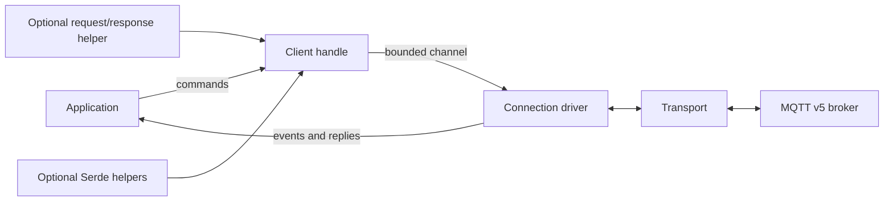

# mqtt-wasi v0.2 design

## Status

This document defines the intended public `0.2` architecture. Version `0.2` is
a deliberate API break from the application-specific `0.1` prototype. The
wire codec and transport boundary remain useful; the client ownership and
request/response layers do not retain `0.1` compatibility.

## Goals

- Provide a small, general-purpose MQTT v5 client for native Rust and
  `wasm32-wasip2`.
- Make raw topics, byte payloads, QoS, and MQTT properties the primary public
  vocabulary.
- Keep protocol encoding and decoding usable with `no_std` plus `alloc`.
- Support blocking applications and async applications without duplicating the
  protocol implementation.
- Keep connections healthy while applications are idle and preserve every
  inbound packet while another operation awaits an acknowledgement.
- Put explicit bounds and deadlines around network-controlled work.
- Keep application protocols, serialization formats, and broker-specific
  conventions outside the core client.

## Architecture

### Protocol core

The codec is a deterministic transformation between MQTT packets and byte
buffers. It depends on `core` and `alloc`, not sockets or an executor. Decoding
must reject malformed packets and declared lengths above the configured limit
before allocating the corresponding payload.

The protocol core owns MQTT concepts only: packet types, QoS, reason codes,
properties, packet identifiers, and framing. It does not know about JSON, RPC
methods, broker-bridge routing keys, or deployment-specific topic prefixes.

### Transport

The transport boundary supplies ordered reads and writes. Plain TCP is the
default implementation under `std`; TLS is an optional implementation. MQTT
state, packet dispatch, deadlines, and retry policy stay above this boundary so
that transport implementations remain interchangeable.

TLS is experimental in `0.2`. In particular, enabling it is an explicit choice
and not evidence that every pure-Rust provider or WASIp2 runtime combination is
production-hardened. The provider glue is alpha and currently introduces a
second `rustls-webpki` dependency line, so release consumers must audit their
resolved TLS graph.

### Blocking client

The blocking client owns its transport and protocol state. Operations that wait
for PUBACK, SUBACK, or UNSUBACK continue dispatching all packets received in the
meantime. Incoming PUBLISH packets go into a bounded FIFO and are returned to
the caller later; they are never discarded merely because an acknowledgement
is outstanding.

Connect and acknowledgement waits have configurable deadlines. Read timeouts
also drive keepalive. An unanswered PINGREQ and a server DISCONNECT are surfaced
as terminal connection errors.

### Async client and connection driver

Async ownership is split in two:

- A cloneable client handle submits bounded commands and awaits operation
  results.
- Exactly one connection driver owns the transport, reads and writes packets,
  advances keepalive, matches acknowledgements, and emits inbound events.

Connection construction is intentionally synchronous: DNS resolution, TCP or
TLS connection, and the MQTT handshake complete before the handle/driver pair
is returned. Async operation begins after that boundary.

The application must continuously run the driver for the connection to make
progress. Dropping the driver closes outstanding operations with a concrete
error. Dropping an individual operation removes its waiter without taking down
the connection.

No implementation of `Future::poll` performs a blocking sleep or independently
pumps the socket. The driver uses executor timers for idle polling and
deadlines, so keepalive remains active even when the application has no pending
publish or request future.

Queues and queued bytes are bounded. When the client cannot accept more work,
it returns backpressure to the caller rather than growing memory without limit.
A full inbound event queue is terminal for the driver; it returns a queue error
instead of silently dropping a PUBLISH.

The public ownership boundary is explicit:

- `AsyncMqttClient::connect` and `connect_with` return an
  `(AsyncMqttClient, MqttConnection<T>)` pair.
- `AsyncMqttClient` is cloneable. Its async `publish`, `subscribe`,
  `unsubscribe`, and `disconnect` methods submit commands to the driver, while
  `next_event` receives connection events.
- `MqttConnection::run` is the single driver future. The application decides
  where to run it and how a terminal driver result affects its supervision
  tree.

The blocking API follows the same bytes-first vocabulary without the driver
split: `publish(topic, payload, PublishOptions)`, `subscribe(filter, QoS)`, and
`recv()` returning the next `PublishPacket`. `PublishPacket` is also the async
event and request/response result type.

### Request/response extension

Request/response is an optional convenience layer, not a second client. It uses
the MQTT v5 Response Topic and Correlation Data properties:

1. The requester subscribes to a reply topic it is authorized to consume.
2. It publishes opaque bytes to the service topic with that reply topic and
   opaque correlation data in the standard MQTT properties.
3. The responder publishes opaque response bytes to the supplied topic and
   copies the correlation data.
4. The helper matches the response and enforces a caller-configurable deadline.

One stable, ACL-scoped reply topic per client is the intended pattern. The
driver caches response subscriptions and bounds distinct cached topics by its
pending-operation limit. Version `0.2` does not automatically evict or
unsubscribe them, so using a new response topic per request eventually
backpressures.

The extension does not define a JSON envelope, an action or method field, a
topic prefix, or slash-to-dot rewriting. Correlation values aid dispatch; they
are not authentication or authorization credentials.

### Serialization

Core publish and receive APIs use byte slices and owned byte buffers. The
optional `serde` feature implies `std` and provides JSON publishing convenience;
receive payloads remain bytes. Wire-format choice stays explicit, serialization
failures remain distinguishable from MQTT or I/O failures, and request/response
works without Serde.

## Safety and reliability invariants

- A peer-controlled Remaining Length is checked against the configured maximum
  packet size before allocating the complete frame.
- CONNECT advertises the maximum inbound packet size when supported by the
  broker-facing codec.
- Connect, acknowledgement, and request operations have deadlines. An
  intentionally long-lived receive loop is not mistaken for a timed-out
  control operation.
- Packet identifiers are not reused while their operation remains in flight.
- ACK waits dispatch unrelated packets instead of consuming them as noise.
- Inbound messages, outbound commands, events, and total queued bytes have
  explicit bounds.
- Keepalive is connection work, not request work.
- Credentials and payloads are not included in default error or trace output.
- Cancellation cannot leak a waiter or cause an eventual reply to be delivered
  to a later operation.
- The crate forbids unsafe code.

## Feature contract

| Feature | Default | Contract |
| --- | --- | --- |
| `std` | yes | Sockets, blocking client, transport, and time-based limits |
| `async-client` | yes | Client-handle/connection-driver API and Tokio current-thread support |
| `request-response` | no | MQTT v5 Response Topic and Correlation Data helper |
| `serde` | no | `std`-only JSON publishing convenience; receive remains bytes |
| `tls` | no | Experimental rustls-based transport for native and WASIp2 builds |

`--no-default-features` builds the protocol core with `no_std` plus `alloc`.
Feature dependencies are additive: optional extensions must not silently enable
unrelated application behavior.

## Compatibility and non-goals

Version `0.2` does not preserve source compatibility with the old
`AsyncMqttClient`, application-specific egress envelopes, broker-bridge reply
rewriting, or typed JSON publish methods from `0.1`.

The following are not `0.2` goals:

- QoS 2 delivery.
- A broker implementation.
- Durable offline queues or persistent session storage.
- Automatic reconnection and resubscription policy.
- A runtime-neutral async abstraction; Tokio's current-thread runtime is the
  initial supported executor, including on WASIp2.
- A framework for application RPC schemas, service discovery, retries, or
  idempotency.
- Treating TLS as a substitute for broker ACLs or application authorization.

These can be added later without weakening the ownership, bounded-memory, or
payload-agnostic boundaries above.

## Release gates

A `0.2` release must pass:

- formatting and Clippy with warnings denied;
- native unit and local Mosquitto integration tests without external secrets;
- the `no_std`/`alloc` build and supported feature combinations;
- default and TLS library builds for `wasm32-wasip2`;
- native and WASIp2 builds for each standalone example;
- rustdoc with warnings denied and `cargo package` verification;
- regression tests for partial frames, packet limits, idle keepalive,
  cancellation, backpressure, and inbound publishes interleaved with ACKs.
